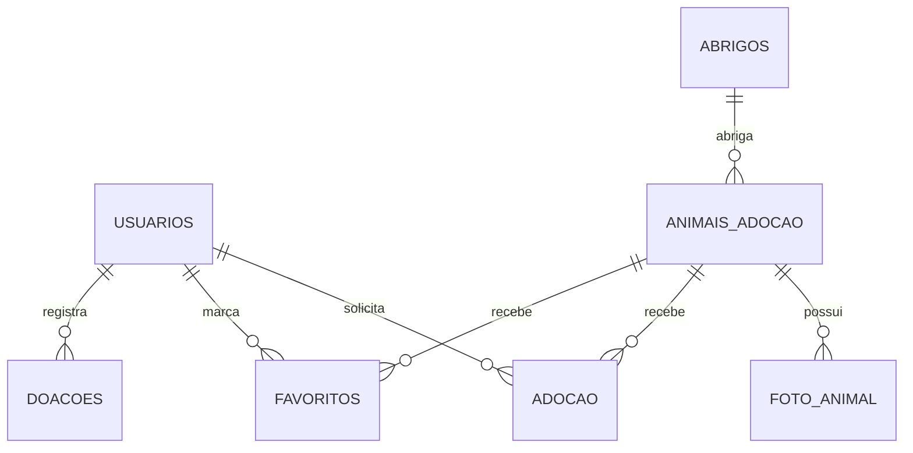

# Banco de Dados

## Visão Geral

O projeto utiliza **MySQL** com acesso via **PDO** definido em `config/conexao.php`. O schema oficial presente em `database/` ainda está incompleto, então a modelagem abaixo foi inferida a partir do código-fonte.

## Arquivos Relacionados

- `database/schema.sql`
- `database/seed.sql`
- `config/conexao.php`

## Entidades Identificadas

- `usuarios`
- `animais_adocao`
- `foto_animal`
- `abrigos`
- `adocao`
- `favoritos`
- `doacoes`

## Relacionamentos



## Dicionário de Dados Inferido

### `usuarios`

| Campo | Tipo sugerido | Descrição |
|---|---|---|
| `id_usuario` | INT PK AUTO_INCREMENT | Identificador do usuário |
| `nome` | VARCHAR | Nome completo |
| `idade` | INT | Idade informada |
| `email` | VARCHAR UNIQUE | E-mail de login |
| `senha` | VARCHAR | Hash da senha |
| `telefone` | VARCHAR | Telefone |
| `cpf` | VARCHAR | CPF informado |
| `data_nascimento` | DATE | Data de nascimento |
| `endereco` | VARCHAR/TEXT | Endereço |
| `cidade` | VARCHAR | Cidade |
| `estado` | VARCHAR | Estado |
| `perfil` | VARCHAR | `user` ou `admin` |

### `animais_adocao`

| Campo | Tipo sugerido | Descrição |
|---|---|---|
| `id_animal` | INT PK AUTO_INCREMENT | Identificador do animal |
| `nome` | VARCHAR | Nome do animal |
| `especie` | VARCHAR | Cachorro, gato ou outro tipo |
| `raca` | VARCHAR | Raça |
| `idade` | VARCHAR | Idade textual ou numérica |
| `sexo` | VARCHAR | Macho ou Fêmea |
| `porte` | VARCHAR | Pequeno, Médio ou Grande |
| `descricao` | TEXT | Descrição geral |
| `deficiencia` | TEXT NULL | Informação de necessidade especial |
| `status_adocao` | VARCHAR | Disponível, Em processo ou Adotado |
| `castrado` | TINYINT/BOOLEAN | Indicador de castração |
| `vacinado` | TINYINT/BOOLEAN | Indicador de vacinação |
| `peso` | DECIMAL | Peso do animal |
| `id_abrigo` | INT FK | Abrigo responsável |
| `abrigo` | VARCHAR | Nome do abrigo em fluxos legados |
| `data_cadastro` | DATE | Data de cadastro |

### `foto_animal`

| Campo | Tipo sugerido | Descrição |
|---|---|---|
| `id_foto` | INT PK AUTO_INCREMENT | Identificador da foto |
| `id_animal` | INT FK | Animal relacionado |
| `ds_img` | VARCHAR | Nome do arquivo salvo em `uploads/` |

### `abrigos`

| Campo | Tipo sugerido | Descrição |
|---|---|---|
| `id` | INT PK AUTO_INCREMENT | Identificador do abrigo |
| `nome` | VARCHAR | Nome do abrigo |
| `cnpj` | VARCHAR | CNPJ |
| `localizacao` | VARCHAR/TEXT | Endereço ou localização |
| `cep` | VARCHAR | CEP |
| `descricao` | TEXT | Descrição institucional |

### `adocao`

| Campo | Tipo sugerido | Descrição |
|---|---|---|
| `id_adocao` | INT PK AUTO_INCREMENT | Identificador da solicitação |
| `id_usuario` | INT FK | Usuário solicitante |
| `id_animal` | INT FK | Animal solicitado |
| `data_solicitacao` | DATE | Data do pedido |
| `status` | VARCHAR | Status do processo |

### `favoritos`

| Campo | Tipo sugerido | Descrição |
|---|---|---|
| `id_favorito` | INT PK AUTO_INCREMENT | Identificador do favorito |
| `id_usuario` | INT FK | Usuário |
| `id_animal` | INT FK | Animal favoritado |
| `data_favorito` | DATE | Data da marcação |

### `doacoes`

| Campo | Tipo sugerido | Descrição |
|---|---|---|
| `id_doacao` | INT PK AUTO_INCREMENT | Identificador da doação |
| `id_usuario` | INT FK | Usuário que registrou a doação |
| `tipo_doacao` | VARCHAR | Dinheiro, ração, roupa etc. |
| `descricao` | TEXT | Detalhe da doação |
| `valor` | DECIMAL NULL | Valor monetário, quando aplicável |
| `data_doacao` | DATE | Data de registro |

## Schema SQL Sugerido

> Este schema é inferido a partir do código e deve ser validado contra o banco real antes de uso produtivo.

```sql
CREATE TABLE usuarios (
    id_usuario INT AUTO_INCREMENT PRIMARY KEY,
    nome VARCHAR(150) NOT NULL,
    idade INT NULL,
    email VARCHAR(180) NOT NULL UNIQUE,
    senha VARCHAR(255) NOT NULL,
    telefone VARCHAR(30) NULL,
    cpf VARCHAR(20) NULL,
    data_nascimento DATE NULL,
    endereco VARCHAR(255) NULL,
    cidade VARCHAR(100) NULL,
    estado VARCHAR(50) NULL,
    perfil VARCHAR(20) NOT NULL DEFAULT 'user'
);

CREATE TABLE abrigos (
    id INT AUTO_INCREMENT PRIMARY KEY,
    nome VARCHAR(150) NOT NULL,
    cnpj VARCHAR(30) NULL,
    localizacao VARCHAR(255) NULL,
    cep VARCHAR(20) NULL,
    descricao TEXT NULL
);

CREATE TABLE animais_adocao (
    id_animal INT AUTO_INCREMENT PRIMARY KEY,
    nome VARCHAR(120) NOT NULL,
    especie VARCHAR(50) NOT NULL,
    raca VARCHAR(100) NULL,
    idade VARCHAR(50) NULL,
    sexo VARCHAR(20) NULL,
    porte VARCHAR(30) NULL,
    descricao TEXT NULL,
    deficiencia TEXT NULL,
    status_adocao VARCHAR(30) NOT NULL DEFAULT 'Disponível',
    castrado TINYINT(1) NULL,
    vacinado TINYINT(1) NULL,
    peso DECIMAL(10,2) NULL,
    id_abrigo INT NULL,
    abrigo VARCHAR(150) NULL,
    data_cadastro DATE NULL,
    CONSTRAINT fk_animais_abrigos FOREIGN KEY (id_abrigo) REFERENCES abrigos(id)
);

CREATE TABLE foto_animal (
    id_foto INT AUTO_INCREMENT PRIMARY KEY,
    id_animal INT NOT NULL,
    ds_img VARCHAR(255) NOT NULL,
    CONSTRAINT fk_foto_animal FOREIGN KEY (id_animal) REFERENCES animais_adocao(id_animal)
);

CREATE TABLE adocao (
    id_adocao INT AUTO_INCREMENT PRIMARY KEY,
    id_usuario INT NOT NULL,
    id_animal INT NOT NULL,
    data_solicitacao DATE NOT NULL,
    status VARCHAR(30) NOT NULL DEFAULT 'Pendente',
    CONSTRAINT fk_adocao_usuario FOREIGN KEY (id_usuario) REFERENCES usuarios(id_usuario),
    CONSTRAINT fk_adocao_animal FOREIGN KEY (id_animal) REFERENCES animais_adocao(id_animal)
);

CREATE TABLE favoritos (
    id_favorito INT AUTO_INCREMENT PRIMARY KEY,
    id_usuario INT NOT NULL,
    id_animal INT NOT NULL,
    data_favorito DATE NOT NULL,
    CONSTRAINT fk_favoritos_usuario FOREIGN KEY (id_usuario) REFERENCES usuarios(id_usuario),
    CONSTRAINT fk_favoritos_animal FOREIGN KEY (id_animal) REFERENCES animais_adocao(id_animal),
    CONSTRAINT uq_favorito UNIQUE (id_usuario, id_animal)
);

CREATE TABLE doacoes (
    id_doacao INT AUTO_INCREMENT PRIMARY KEY,
    id_usuario INT NOT NULL,
    tipo_doacao VARCHAR(50) NOT NULL,
    descricao TEXT NULL,
    valor DECIMAL(10,2) NULL,
    data_doacao DATE NOT NULL,
    CONSTRAINT fk_doacoes_usuario FOREIGN KEY (id_usuario) REFERENCES usuarios(id_usuario)
);
```
