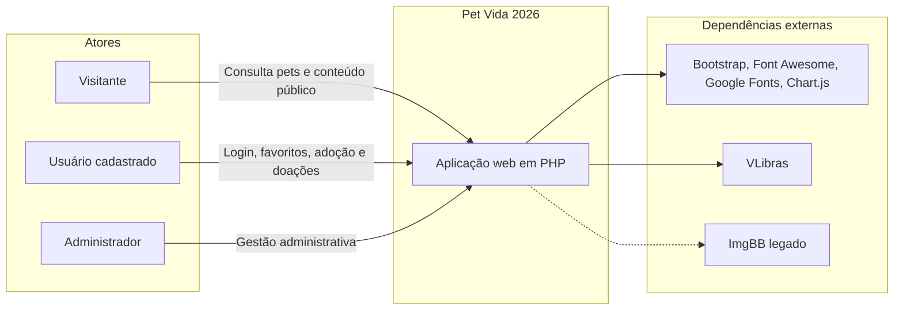
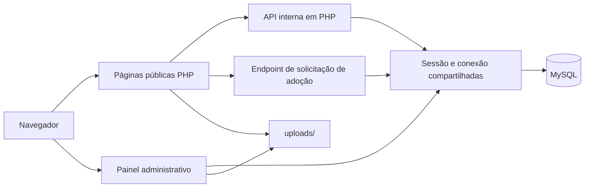
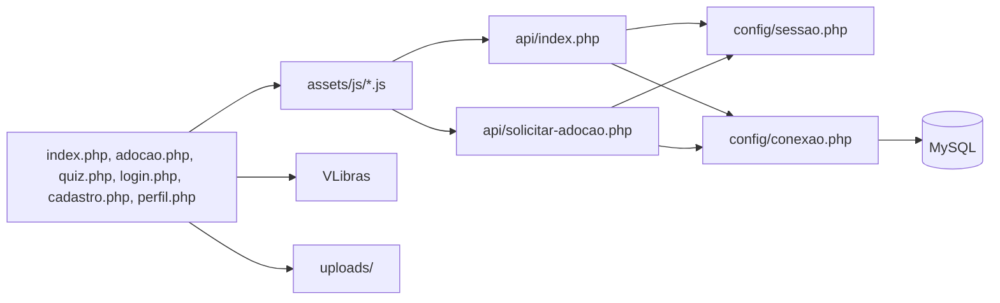
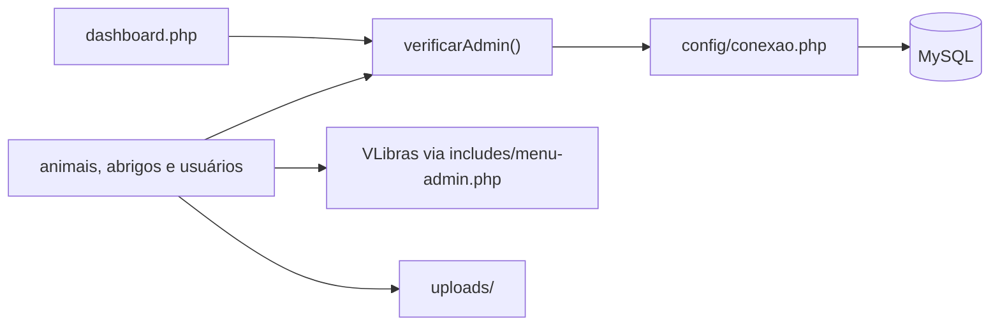

# Estrutura e Arquitetura

## Visão Geral da Arquitetura

O sistema segue uma arquitetura **monolítica em PHP**, com páginas renderizadas no servidor, scripts JavaScript para interações no navegador e comunicação com o banco de dados via **PDO**.

Características centrais:

- Páginas públicas em PHP tradicional
- Painel administrativo protegido por perfil `admin`
- API interna em PHP para login, cadastro, perfil, favoritos e doações
- Sessão nativa do PHP para autenticação e controle de acesso
- Upload local de imagens em `uploads/`

## Estrutura de Pastas

```text
Pet-Vida-2026/
├── admin/
├── api/
├── assets/
│   ├── css/
│   ├── img/
│   ├── js/
│   └── video/
├── config/
├── database/
├── docs/
├── includes/
├── uploads/
├── index.php
├── adocao.php
├── quiz.php
├── login.php
├── cadastro.php
├── perfil.php
├── api.php
└── solicitar_adocao.php
```

## Responsabilidade das Pastas

| Pasta | Responsabilidade |
|---|---|
| `admin/` | Telas e operações administrativas |
| `api/` | Endpoints usados por JavaScript e fluxos específicos |
| `assets/css/` | Estilos visuais do site público, adoção, quiz e admin |
| `assets/js/` | Scripts de autenticação, perfil, adoção, quiz e interações do site |
| `assets/img/` | Imagens fixas, logos, banners e recursos visuais |
| `config/` | Conexão com banco e controle de sessão |
| `database/` | Arquivos SQL do projeto |
| `docs/` | Documentação técnica e material legado |
| `includes/` | Componentes compartilhados e funções auxiliares |
| `uploads/` | Imagens enviadas pelo sistema |

## Arquivos Principais

### Raiz pública

| Arquivo | Responsabilidade |
|---|---|
| `index.php` | Home, vitrine de animais e seções institucionais |
| `adocao.php` | Página principal de adoção com filtros, cards e detalhes |
| `quiz.php` | Quiz de compatibilidade com pets |
| `login.php` | Tela de autenticação |
| `cadastro.php` | Tela de cadastro de usuário |
| `perfil.php` | Atualização dos dados do usuário autenticado |
| `api.php` | Wrapper para `api/index.php` |
| `solicitar_adocao.php` | Wrapper para `api/solicitar-adocao.php` |

### Infraestrutura e compartilhamento

| Arquivo | Responsabilidade |
|---|---|
| `config/conexao.php` | Instancia a conexão PDO com MySQL |
| `config/sessao.php` | Inicia sessão e valida usuário/admin |
| `includes/header.php` | Header público, dependências externas, VLibras e navegação |
| `includes/footer.php` | Footer público, contato e modal de doação |
| `includes/helpers.php` | Funções de caminho e apoio estrutural |
| `includes/menu-admin.php` | Menu lateral do painel administrativo e carga centralizada do VLibras |
| `includes/animal-admin-helpers.php` | Upload, remoção e fallback de imagens de animais |

## Acessibilidade

- O widget `VLibras` é uma dependência externa carregada no frontend.
- `includes/header.php` cobre as páginas públicas que usam layout compartilhado, como `index.php`, `login.php`, `cadastro.php` e `perfil.php`.
- `adocao.php` e `quiz.php` carregam o `VLibras` diretamente no próprio arquivo, pois possuem estrutura HTML independente.
- `includes/menu-admin.php` centraliza a inclusão do `VLibras` nas páginas do painel administrativo que reutilizam o menu lateral.

## Visão Contexto do sistema



## Visão Detalhamento da Aplicação



## Visão Componentes do site público e API 

### Site público e API



## Visão Painel administrativo

### Painel administrativo



## Compatibilidade Mantida

- As páginas públicas principais continuam na raiz.
- `api.php` e `solicitar_adocao.php` permanecem como pontos de entrada compatíveis com chamadas antigas.
- O material anterior foi preservado em `docs/legado/` apenas para consulta.
